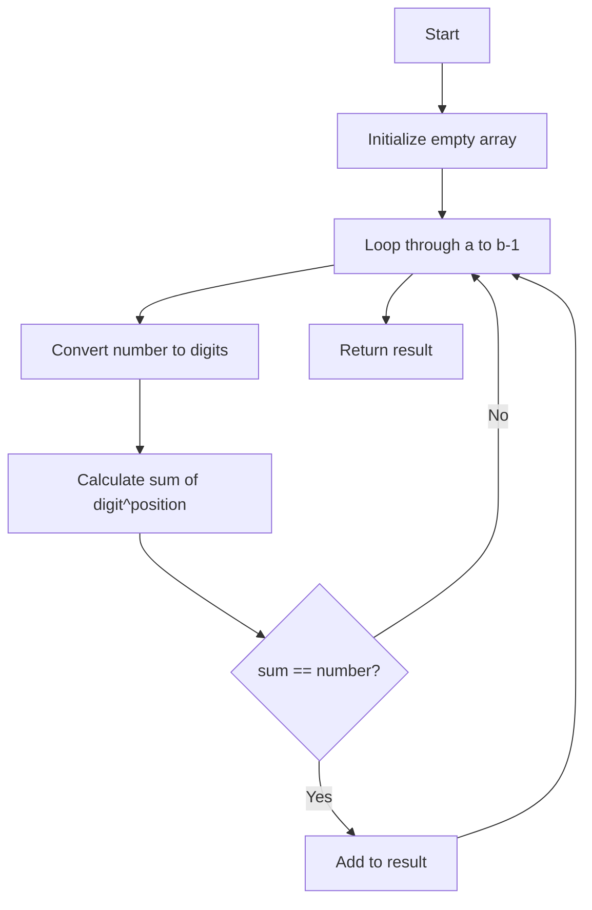

# Find Numbers Equal to Sum of Digit Powers

## Problem

Write a function `sumDigPow(a, b)` that returns numbers in range `[a, b)` where a number equals the sum of its digits raised to their position powers (1-based index).



## Hints

<details>
<summary>Click to reveal hints</summary>

1. **Number to Digits Conversion**:

   ```javascript
   const digits = num.toString().split("");
   ```

2. **Position Power Calculation**:

   ```javascript
   // For each digit at index i
   sum += Math.pow(digit, i + 1);
   ```

3. **Range Handling**:

   - Current implementation excludes `b` (uses `<` operator)
   - Change to `<=` for inclusive range

4. **Edge Cases**:
   - All single-digit numbers automatically qualify
   - Return empty array if no matches found
   </details>

## Examples

```javascript
console.log(sumDigPow(1, 10)); // [1, 2, 3, 4, 5, 6, 7, 8, 9]
console.log(sumDigPow(10, 100)); // [89] (since 8^1 + 9^2 = 89)
console.log(sumDigPow(90, 100)); // []
```

## Verification

```javascript
// Test Cases
console.assert(JSON.stringify(sumDigPow(1, 10)) === "[1,2,3,4,5,6,7,8,9]");
console.assert(JSON.stringify(sumDigPow(135, 136)) === "[135]");
console.assert(JSON.stringify(sumDigPow(100, 103)) === "[]");
```

Generated with Deepseek Chat
