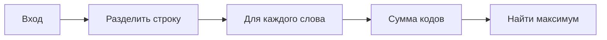

# Задача: Сумма кодов букв

## Условие

Напишите функцию, которая находит слово с наибольшей суммой ASCII-кодов букв (a=1, b=2,...).



## Пример

```javascript
high("man i need a taxi"); // "taxi" (20 + 1 + 24 + 9 = 54)
```

## Решение

<details>
<summary>Подсказка</summary>

1. Используйте `String.charCodeAt()`
2. Не забудьте вычесть 96 для строчных латинских букв
</details>

## Проверка

```javascript
console.assert(high("abc") === "abc", "Тест не пройден");
```

## Generated with Deepseek
