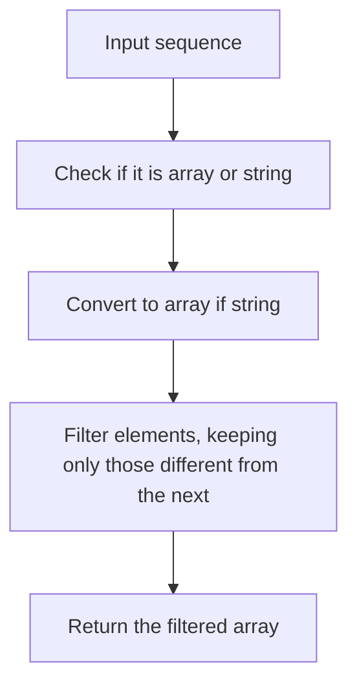

# Unique In Order

## Condition

Implement the function `uniqueInOrder` which takes as an argument a sequence and returns a list of items without any elements with the same value next to each other, while preserving the original order of elements.

The sequence can be either a **string** or an **array**.



## Example

```javascript
uniqueInOrder("AAAABBBCCDAABBB"); // ['A', 'B', 'C', 'D', 'A', 'B']
uniqueInOrder("ABBCcAD");         // ['A', 'B', 'C', 'c', 'A', 'D']
uniqueInOrder([1, 2, 2, 3, 3]);   // [1, 2, 3]
```

## Hints

<details>
<summary>Click to reveal</summary>

1. Use `Array.isArray()` to check if the input is an array.
2. If it's not an array, use `split("")` to convert the string to an array of characters.
3. Use `filter()` to keep only elements that are different from the next element.
4. Preserve the original order and ignore elements that are the same as the next one.
</details>

## Tests

```javascript
console.assert(JSON.stringify(uniqueInOrder("AAAABBBCCDAABBB")) === JSON.stringify(['A', 'B', 'C', 'D', 'A', 'B']));
console.assert(JSON.stringify(uniqueInOrder("ABBCcAD")) === JSON.stringify(['A', 'B', 'C', 'c', 'A', 'D']));
console.assert(JSON.stringify(uniqueInOrder([1, 2, 2, 3, 3])) === JSON.stringify([1, 2, 3]));
console.assert(JSON.stringify(uniqueInOrder([])) === JSON.stringify([]));
console.assert(JSON.stringify(uniqueInOrder("")) === JSON.stringify([]));
```

Generated with ChatGPT
