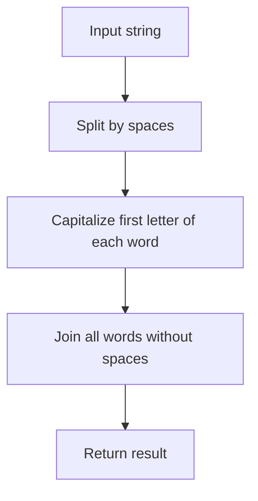

# Convert String to CamelCase

## Condition

Write a method that converts a string to camelCase.  
That is, all words must have their first letter capitalized and spaces must be removed.



## Example

```javascript
"hello case".camelCase(); // "HelloCase"
"camel case word".camelCase(); // "CamelCaseWord"
"camel Case method".camelCase(); // "CamelCaseMethod"
```

## Hints

<details>
<summary>Click to reveal</summary>

1. Use `split(" ")` to divide the string into words.
2. Use `map()` to capitalize the first letter of each word.
3. Filter out empty strings if needed.
4. Use `join("")` to merge words without spaces.
</details>

## Tests

```javascript
String.prototype.camelCase = function () {
  return this.split(" ")
    .map((el) => el && el[0].toUpperCase() + el.slice(1))
    .join("");
};

console.assert("hello case".camelCase() === "HelloCase");
console.assert("camel case word".camelCase() === "CamelCaseWord");
console.assert("camel Case method".camelCase() === "CamelCaseMethod");
console.assert("".camelCase() === "");
console.assert(
  "  leading and  multiple   spaces".camelCase() === "LeadingAndMultipleSpaces"
);
```

Generated with ChatGPT
