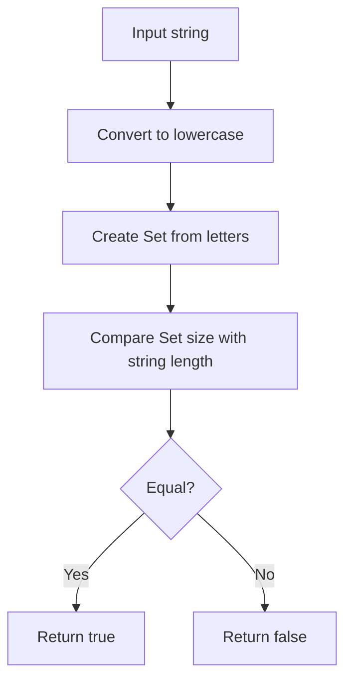

# Check if a Word is an Isogram

## Condition

Implement a function `isIsogram(str)` that returns `true` if the word has no repeating letters (case insensitive), and `false` otherwise. An empty string should return `true`.



## Example

```javascript
isIsogram("Dermatoglyphics"); // true
isIsogram("moOse"); // false
isIsogram(""); // true
```

## Hints

<details>
<summary>Click to reveal</summary>

1. Use `toLowerCase()` for case insensitivity
2. `Set` automatically removes duplicates
3. Compare `Set.size` with original length
4. Empty string should return `true`
</details>

## Tests

```javascript
console.assert(isIsogram("isogram") === true);
console.assert(isIsogram("aba") === false);
console.assert(isIsogram("abcdefghijklmnopqrstuvwxyz") === true);
console.assert(isIsogram("aA") === false);
```

Generated with Deepseek Chat
