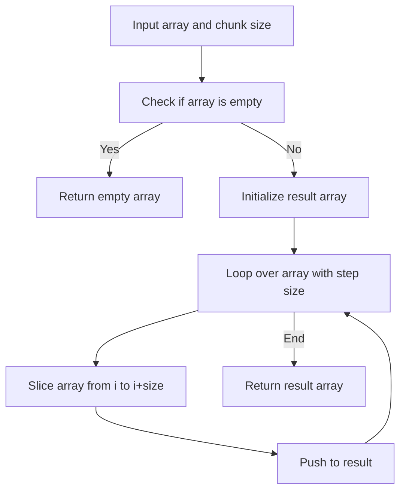

V# Chunk Array

## Condition

Implement a function `chunk(arr, size)` that splits an array into multiple subarrays (chunks) where each chunk is of length `size`. The last chunk may be smaller if there are not enough elements. Do not use lodash's `_.chunk` function.



## Example

```javascript
chunk([1, 2, 3, 4, 5], 1); // [[1], [2], [3], [4], [5]]
chunk([1, 9, 6, 3, 2], 3); // [[1, 9, 6], [3, 2]]
chunk([8, 5, 3, 2, 6], 6); // [[8, 5, 3, 2, 6]]
chunk([], 1); // []
```

## Hints

<details>
<summary>Click to reveal</summary>

1. Use a loop with `i += size` to move by chunks.
2. Inside the loop, use `arr.slice(i, i + size)` to get a subarray.
3. Push each subarray to a `result` array.
4. Return `result` at the end.
5. Edge case: if the input array is empty, return `[]`.

</details>

## Tests

```javascript
console.assert(
  JSON.stringify(chunk([1, 2, 3, 4, 5], 1)) ===
    JSON.stringify([[1], [2], [3], [4], [5]])
);
console.assert(
  JSON.stringify(chunk([1, 9, 6, 3, 2], 3)) ===
    JSON.stringify([
      [1, 9, 6],
      [3, 2],
    ])
);
console.assert(
  JSON.stringify(chunk([8, 5, 3, 2, 6], 6)) ===
    JSON.stringify([[8, 5, 3, 2, 6]])
);
console.assert(JSON.stringify(chunk([], 1)) === JSON.stringify([]));
```

Generated with ChatGPT
