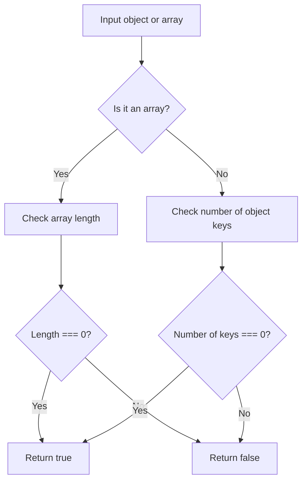

# Check if an Object or Array is Empty

## Condition

Implement a function `isEmpty(obj)` that returns `true` if the given object or array is empty, and `false` otherwise.

- An **empty object** contains no key-value pairs.
- An **empty array** contains no elements.
- The input `obj` is guaranteed to be a valid result of `JSON.parse`.

You should try to achieve **O(1)** time complexity if possible.



## Example

```javascript
isEmpty({ "x": 5, "y": 42 }); // false
isEmpty({});                  // true
isEmpty([null, false, 0]);     // false
isEmpty([]);                   // true
```

## Hints

<details>
<summary>Click to reveal</summary>

1. **Arrays**: Use `.length` property to check if an array has elements.

2. **Objects**: Use `Object.keys(obj)` or `Object.entries(obj)` to get key-value pairs and check their length.

3. **Optimization**: Checking the `.length` is an O(1) operation for both arrays and objects.

4. **Type Check**: Use `Array.isArray(obj)` to distinguish between arrays and objects.

</details>

## Tests

```javascript
console.assert(isEmpty({ "x": 5, "y": 42 }) === false, "Test Case 1 Failed");
console.assert(isEmpty({}) === true, "Test Case 2 Failed");
console.assert(isEmpty([null, false, 0]) === false, "Test Case 3 Failed");
console.assert(isEmpty([]) === true, "Test Case 4 Failed");
console.assert(isEmpty(["a"]) === false, "Test Case 5 Failed");
console.assert(isEmpty({ "a": 1 }) === false, "Test Case 6 Failed");
console.assert(isEmpty({ "a": undefined }) === false, "Test Case 7 Failed");
```

Generated with ChatGPT
