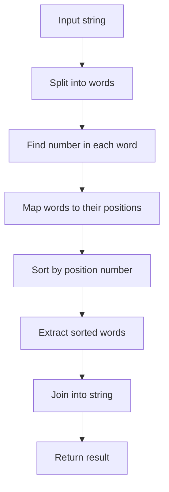

# Order Words by Number

## Condition

Implement a function `order(words)` that returns a string with the words sorted according to the number in each word.  
Each word in the input string will contain a single digit from 1 to 9, which indicates the word's position in the final result.

If the input string is empty, return an empty string.



### Example

```javascript
order("is2 Thi1s T4est 3a");
// "Thi1s is2 3a T4est"
order("4of Fo1r pe6ople g3ood th5e the2");
// "Fo1r the2 g3ood 4of th5e pe6ople"
order("");
// ""
```

### Hints

<details> <summary>Click to reveal</summary>

1. Use split(" ") to split the string into words.
2. Loop through each word and use a regular expression or parseInt to find the digit.
3. Store the word in an object or array with its corresponding number.
4. Sort the array by the number.
5. Join the sorted words with spaces.

</details>

### Tests

```javascript
console.assert(order("is2 Thi1s T4est 3a") === "Thi1s is2 3a T4est"); // basic reordering
console.assert(
  order("4of Fo1r pe6ople g3ood th5e the2") ===
    "Fo1r the2 g3ood 4of th5e pe6ople"
); // more words
console.assert(order("") === ""); // empty input
console.assert(order("3three 1one 2two") === "1one 2two 3three"); // numbers in order 3-1-2
```
